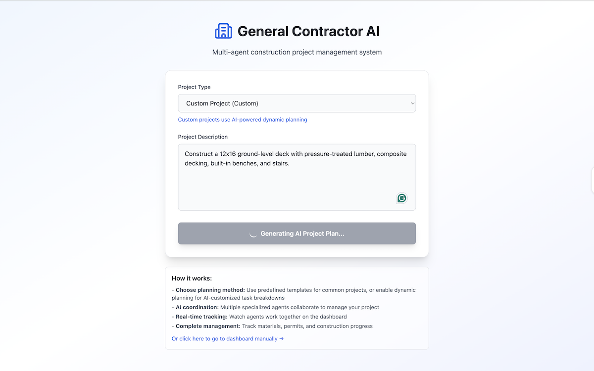
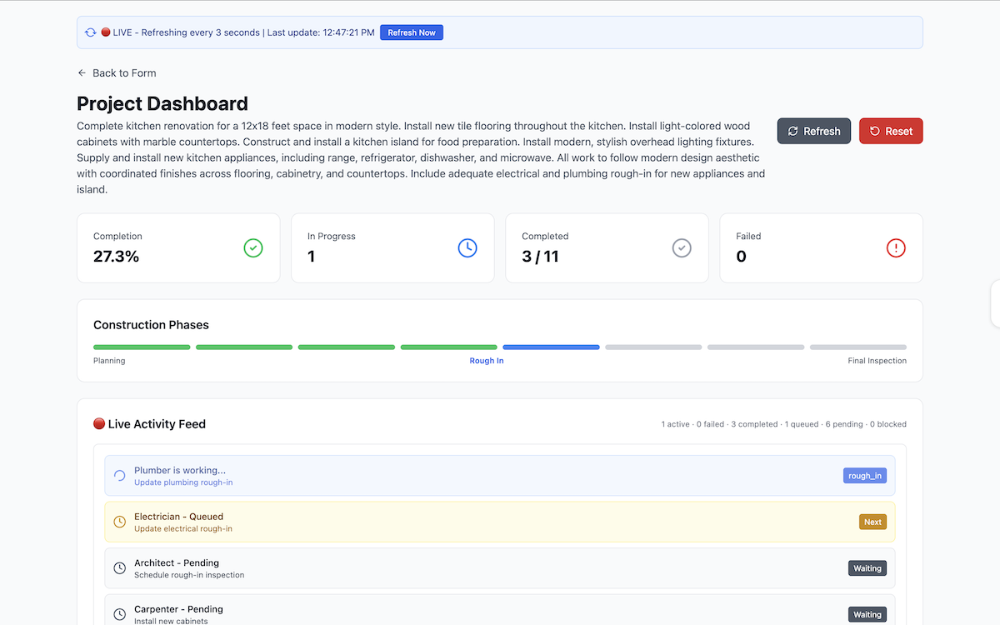
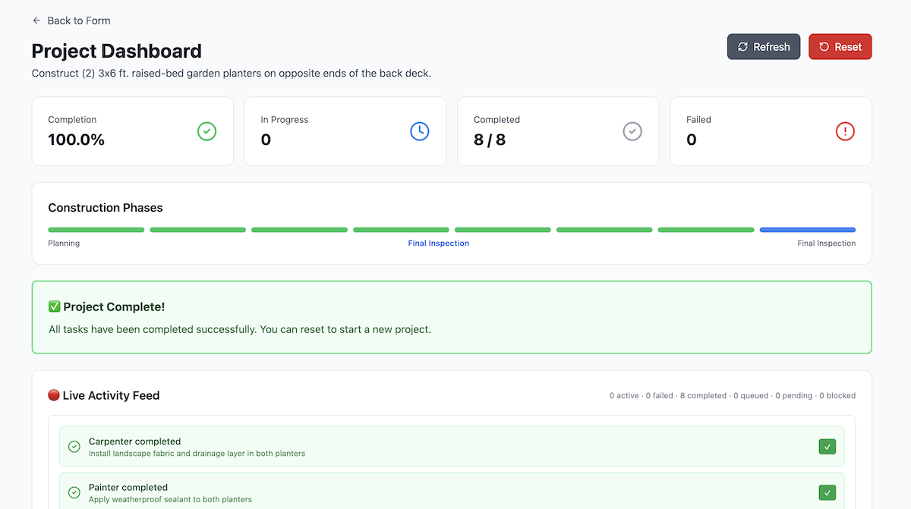
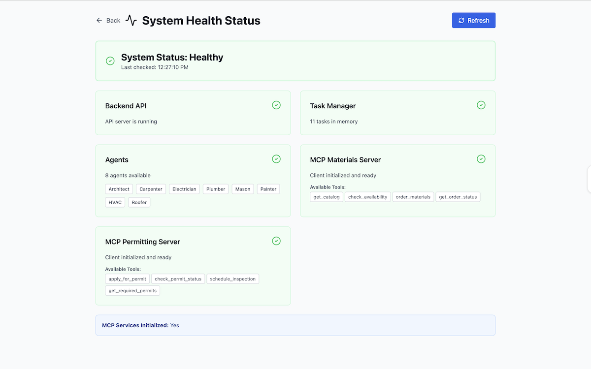
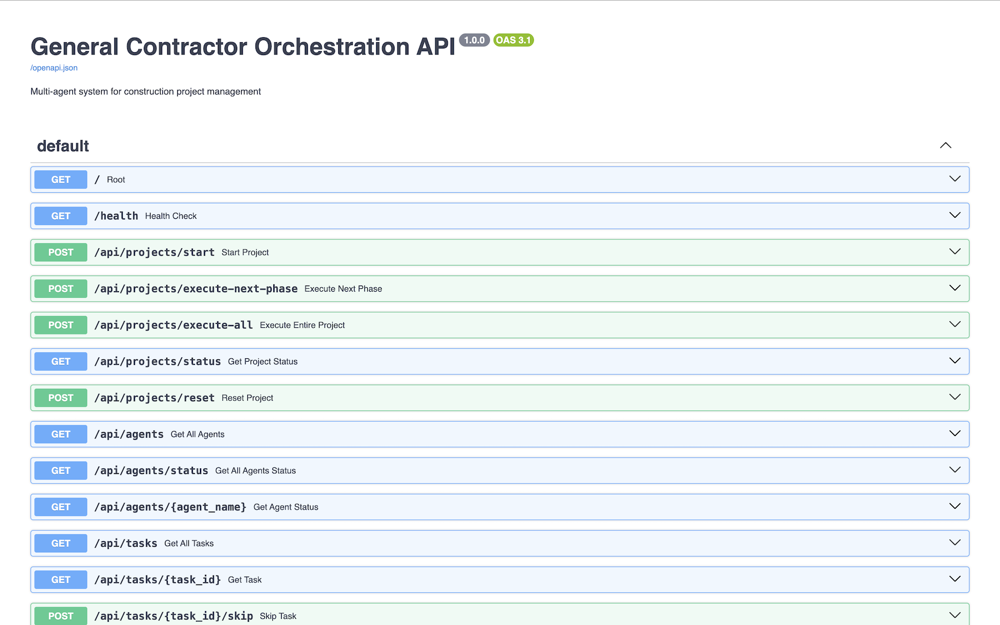
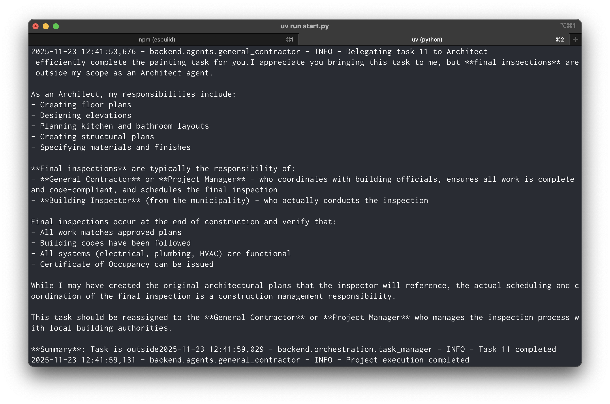

# General Contractor Agent Demo

A full-stack multi-agent orchestration system demonstrating construction project management using AI agents. This project uses the analogy of a general contractor coordinating specialized trade agents to illustrate how complex, multi-agent AI systems can be designed and orchestrated.

## Tech Stack

Built with [Strands Agents](https://strandsagents.com/latest/) framework, Amazon Bedrock, React, and TypeScript.

**Backend:**

- Python 3.13+
- AWS Strands Agents framework
- Amazon Bedrock (Anthropic Claude LLMs)
- FastAPI + Uvicorn
- Pydantic for data validation
- MCP (Model Context Protocol) servers

**Frontend:**

- React 18
- TypeScript
- Vite (build tool)
- Tailwind CSS v3
- Zustand (state management)
- React Router
- Axios (API client)
- React Hot Toast (notifications)
- Lucide React (icons)

## Previews

### React Frontend Project Submission Form



### React Frontend Dashboard





### React System Health Dashboard



### FastAPI Backend API



### Backend Logs




---

## 🚀 Quick Start

Get the system running locally in under 5 minutes!

### Prerequisites

- **Python 3.13+** with [uv package manager](https://docs.astral.sh/uv/getting-started/installation/)
- **Node.js 18+** with npm
- **AWS Credentials** configured (access keys or AWS profile)

### Setup

**1. Clone and navigate to the project:**

```bash
cd general-contractor-agent-demo
```

**2. Set up Python environment:**

```bash
# Install uv package manager (if not installed)
curl -LsSf https://astral.sh/uv/install.sh | sh

# Install Python dependencies
uv sync

# Activate virtual environment
source .venv/bin/activate
```

**3. Set up Node environment:**

```bash
# Navigate to frontend directory
cd frontend

# Install dependencies
npm install

# Return to project root
cd ..
```

**4. Configure environment variables:**

```bash
# Copy example env file
cp .env.example .env

# Amazon Bedrock Configuration
# Authentication: Use AWS SSO login (aws sso login) with a profile, or use explicit credentials below
# Recommended: Use AWS_PROFILE for SSO-based authentication
# AWS_PROFILE=default

# Optional: Hardcode credentials (not recommended if using AWS SSO)
# AWS_ACCESS_KEY_ID="your-access-key-id"
# AWS_SECRET_ACCESS_KEY="your-secret-access-key"
# AWS_SESSION_TOKEN="your-session-token"
```

Example `.env` configuration:

```bash
DEFAULT_MODEL=us.anthropic.claude-sonnet-4-5-20250929-v1:0
TASK_TIMEOUT_SECONDS=120
MAX_CONSECUTIVE_TOOL_CALLS=3
MAX_TOTAL_TOOL_CALLS=20
MAX_IDENTICAL_CALLS=2
ENABLE_LOOP_DETECTION=true
LOG_LEVEL=INFO
```

### Running the Application

**Terminal 1 - Start Backend:**

```bash
# From project root
uv run start.py
```

This starts:

- Materials Supplier MCP server
- Permitting Service MCP server
- FastAPI backend at `http://localhost:8000`

**Terminal 2 - Start Frontend:**

```bash
# In frontend directory
cd frontend
npm run dev
```

This starts the React frontend at `http://localhost:5173`

**3. Open your browser:**

Navigate to `http://localhost:5173` to see the UI!

Try out pre-configured projects, such as the **Kitchen Remodel (Template)**:

```text
Complete kitchen renovation for a 12x18 feet space in modern style. Install new tile flooring throughout the kitchen. Install light-colored wood cabinets with marble countertops. Construct and install a kitchen island for food preparation. Install modern, stylish overhead lighting fixtures. Supply and install new kitchen appliances, including range, refrigerator, dishwasher, and microwave. All work to follow modern design aesthetic with coordinated finishes across flooring, cabinetry, and countertops. Include adequate electrical and plumbing rough-in for new appliances and island.
```

Or, use the **Custom Project (Custom)**, such as:

```text
Build an 8x10 garden shed with a single window, wood siding, an asphalt shingle roof, and a concrete slab foundation. Siding should be painted light green. Include electrical wiring for one outlet and one overhead light fixture.
```

---

## 📋 Table of Contents

- [Overview](#overview)
- [Key Features](#key-features)
- [Architecture](#architecture)
- [Frontend Dashboard](#frontend-dashboard)
- [Backend API](#backend-api)
- [Testing](#testing)
- [API Endpoints](#api-endpoints)
- [Project Types](#project-types)
- [Development](#development)
- [Troubleshooting](#common-issues--troubleshooting)
- [Documentation](#documentation)

---

## Overview

This system models a construction project where a **General Contractor** agent orchestrates multiple specialized trade agents (Architect, Carpenter, Electrician, Plumber, Mason, Painter, HVAC, and Roofer). Each agent has specialized tools and expertise, and the General Contractor manages task dependencies, sequencing, and resource allocation.

## Key Features

### Backend

- **8 Specialized Trade Agents**: Each with domain-specific tools and expertise
- **Task Dependency Management**: Automatic sequencing based on construction workflows
- **Phase-based Orchestration**: Projects progress through multiple construction phases
- **Material Management**: Integrated building materials supplier MCP server
- **Permitting System**: Construction permit and inspection management MCP server
- **Loop Detection**: Prevents infinite loops with configurable thresholds
- **Task Recovery**: Skip or retry failed/stuck tasks to unblock projects
- **REST API**: Complete API for project management and monitoring
- **Real-time Status Tracking**: Monitor agent status, task progress, and project completion

### Frontend

- **React + TypeScript**: Modern, type-safe UI built with Vite
- **Real-time Dashboard**: Live updates every few second during task execution
- **Live Activity Feed**: Watch agents work in real-time with color-coded task cards
- **Phase Progress Visualization**: Track progress through 8 construction phases
- **Task Management UI**: Skip or retry failed tasks directly from the dashboard
- **Project Templates**: Pre-configured templates for common construction projects
- **Responsive Design**: Works on desktop and mobile with Tailwind CSS
- **Toast Notifications**: User feedback for all actions

---

## Architecture

### System Overview

```text
┌─────────────────────────────────────────────────────────────┐
│                     React Frontend                          │
│  (Project Form, Dashboard, Live Activity Feed)              │
└──────────────────────┬──────────────────────────────────────┘
                       │ HTTP/REST API
                       ↓
┌─────────────────────────────────────────────────────────────┐
│                   FastAPI Backend                           │
│  - Project Management  - Task Execution                     │
│  - Agent Orchestration - Status Tracking                    │
└───────────────────────┬─────────────────────────────────────┘
                        │
        ┌───────────────┼─────────────────┐
        ↓               ↓                 ↓
┌──────────────┐ ┌─────────────┐ ┌──────────────────┐
│   General    │ │ Specialized │ │   MCP Servers    │
│  Contractor  │ │   Agents    │ │ - Materials      │
│(Orchestrator)│ │ (8 Trades)  │ │ - Permitting     │
└──────────────┘ └─────────────┘ └──────────────────┘
```

### Component Details

#### General Contractor (Orchestrator)

- Central orchestration agent powered by Amazon Bedrock and Anthropic Claude
- Manages task sequencing and dependencies
- Delegates work to specialized trade agents
- Integrates with MCP servers for materials and permits

#### Specialized Trade Agents

- Architect Agent (design & planning)
- Carpenter Agent (framing, cabinetry, finishing)
- Electrician Agent (wiring, fixtures)
- Plumber Agent (pipes, fixtures)
- Mason Agent (concrete, masonry)
- Painter Agent (painting, finishing)
- HVAC Agent (heating, cooling systems)
- Roofer Agent (roofing, gutters)

#### MCP Servers (Model Context Protocol)

Two MCP servers run as separate processes, communicating via `stdio`:

1. **Materials Supplier Server** (`backend/mcp_servers/materials_supplier.py`)

   - Tools: `check_availability`, `order_materials`, `get_catalog`, `get_order`
   - Manages inventory, pricing, and material ordering
   - Categories: lumber, electrical, plumbing, masonry, paint, HVAC, roofing

2. **Permitting Service Server** (`backend/mcp_servers/permitting.py`)
   - Tools: `apply_for_permit`, `check_permit_status`, `schedule_inspection`, `get_required_permits`, `get_inspection`
   - Handles construction permits and inspections
   - Permit types: building, electrical, plumbing, mechanical, demolition, roofing

#### Task Manager

- Manages task dependencies and sequencing
- Tracks task states: pending, ready, in_progress, completed, failed
- Supports 8 construction phases: planning, permitting, foundation, framing, rough_in, inspection, finishing, final_inspection

---

## Frontend Dashboard

The React frontend provides a comprehensive real-time view of your construction project:

### Features

**Project Form**

- Choose from pre-configured project templates (Kitchen, Bathroom, Shed, etc.)
- Or describe a custom project with dynamic planning
- Configure project parameters and submit

**Dashboard Components**

1. **Auto-Refresh Indicator**

   - Shows "🔴 LIVE" when tasks are in progress
   - Updates every few seconds for real-time feedback
   - Manual refresh button available

2. **Stats Cards**

   - Completion percentage
   - Tasks in progress
   - Completed/Total tasks
   - Failed tasks count

3. **Phase Progress Bar**

   - Visual representation of 8 construction phases
   - Color-coded: green (completed), blue (current), gray (upcoming)
   - Shows current phase name

4. **Live Activity Feed** (scrollable, 600px height)

   - **Blue cards (pulsing)**: Agents currently working
   - **Green cards**: Completed tasks (most recent first)
   - **Yellow cards**: Queued tasks waiting to start

5. **Control Buttons**
   - **Refresh**: Manual data refresh
   - **Reset**: Clear project and start over

---

## Backend API

### FastAPI Server

The backend provides a complete REST API for project management:

**API Documentation** (when server is running):

- Swagger UI: `http://localhost:8000/docs`
- ReDoc: `http://localhost:8000/redoc`

### Key Endpoints

**Project Management**

- `POST /api/projects/start` - Start a new project
- `POST /api/projects/execute-next-phase` - Execute next phase
- `POST /api/projects/execute-all` - Execute entire project
- `GET /api/projects/status` - Get project status
- `POST /api/projects/reset` - Reset for new project

**Task Management**

- `GET /api/tasks` - Get all tasks
- `GET /api/tasks/{task_id}` - Get specific task
- `POST /api/tasks/{task_id}/skip` - Skip failed task
- `POST /api/tasks/{task_id}/retry` - Retry failed task

**Agent Management**

- `GET /api/agents` - List all agents
- `GET /api/agents/status` - Get all agents' status
- `GET /api/agents/{agent_name}` - Get specific agent status

**Materials & Permitting**

- `GET /api/materials/catalog` - Browse materials
- `POST /api/materials/order` - Order materials
- `POST /api/permits/apply` - Apply for permit
- `POST /api/permits/inspections` - Schedule inspection

---

## Amazon Bedrock Setup

For detailed instructions, see [Amazon Bedrock Model Access Documentation](https://docs.aws.amazon.com/bedrock/latest/userguide/model-access.html).

---

## Testing

### Demo Mode (No AWS Required) ⭐ RECOMMENDED

```bash
# Run shed construction demo with simulated output
uv run tests/test_shed_demo.py
```

Shows:

- Real-time agent reasoning
- Tool calls with inputs
- Tool execution results
- Task-by-task progress

**Perfect for seeing how the system works without AWS setup!**

### Planning Mode (No AWS Required)

```bash
# See complete task breakdown and dependencies
uv run tests/test_shed_detailed.py
```

Shows:

- All 10 tasks for building a shed
- Task dependencies and phases
- Materials and requirements
- Agent workload distribution

### Single Agent Test (AWS Required)

```bash
# Test a single agent with Amazon Bedrock
uv run tests/test_agent.py
```

Verifies:

- AWS credentials configured correctly
- Bedrock access working
- Strands Agents framework setup

### Full Execution Mode (AWS Required)

```bash
# Execute with real Claude AI agents
uv run tests/test_shed_detailed.py execute
```

Shows live streaming of:

- Real Claude AI agent reasoning
- Actual tool calls and results
- Complete project execution (5-10 minutes)

### MCP Integration Tests

```bash
# Test MCP servers
uv run tests/test_mcp_integration.py
```

Tests:

- Materials supplier MCP server
- Permitting service MCP server
- Full integration scenarios

**See [TESTING.md](docs/TESTING.md) for comprehensive testing documentation.**

---

## API Endpoints

### Complete Endpoint Reference

#### Project Management

| Method | Endpoint                           | Description                            |
| ------ | ---------------------------------- | -------------------------------------- |
| POST   | `/api/projects/start`              | Start a new construction project       |
| POST   | `/api/projects/execute-next-phase` | Execute next construction phase        |
| POST   | `/api/projects/execute-all`        | Execute entire project to completion   |
| GET    | `/api/projects/status`             | Get current project status and metrics |
| POST   | `/api/projects/reset`              | Reset project for new start            |

#### Task Management

| Method | Endpoint                     | Description                                |
| ------ | ---------------------------- | ------------------------------------------ |
| GET    | `/api/tasks`                 | Get all tasks with status                  |
| GET    | `/api/tasks/{task_id}`       | Get specific task details                  |
| POST   | `/api/tasks/{task_id}/skip`  | Skip failed/stuck task to unblock progress |
| POST   | `/api/tasks/{task_id}/retry` | Retry failed task                          |

#### Agent Management

| Method | Endpoint                   | Description                                |
| ------ | -------------------------- | ------------------------------------------ |
| GET    | `/api/agents`              | List all available agents                  |
| GET    | `/api/agents/status`       | Get status of all agents                   |
| GET    | `/api/agents/{agent_name}` | Get specific agent status and current task |

#### Materials Supplier

| Method | Endpoint                            | Description                                      |
| ------ | ----------------------------------- | ------------------------------------------------ |
| GET    | `/api/materials/catalog`            | Get materials catalog (optional category filter) |
| POST   | `/api/materials/check-availability` | Check material availability                      |
| POST   | `/api/materials/order`              | Place materials order                            |
| GET    | `/api/materials/orders/{order_id}`  | Get order details and status                     |

#### Permitting Service

| Method | Endpoint                                   | Description                           |
| ------ | ------------------------------------------ | ------------------------------------- |
| POST   | `/api/permits/apply`                       | Apply for construction permit         |
| GET    | `/api/permits/{permit_id}`                 | Check permit status                   |
| POST   | `/api/permits/inspections`                 | Schedule inspection                   |
| GET    | `/api/permits/inspections/{inspection_id}` | Get inspection details                |
| POST   | `/api/permits/required`                    | Get required permits for project type |

---

## Project Types

The system supports pre-configured project templates with automatic task sequencing:

### Kitchen Remodel

- Architectural design
- Permit application
- Demolition
- Plumbing & electrical rough-in
- Inspection
- Cabinet installation
- Fixture installation
- Painting
- Final inspection

### Bathroom Remodel

- Design and planning
- Permitting
- Demolition
- Plumbing & electrical work
- Drywall and finishing
- Fixture installation
- Final inspection

### Shed Construction

- Architectural plans
- Foundation (concrete slab)
- Framing (walls and roof)
- Roofing installation
- Electrical wiring
- Siding and exterior
- Painting
- Final walkthrough

### New Construction

- Architectural plans
- Building permits
- Foundation
- Framing
- Roofing
- Systems (electrical, plumbing, HVAC)
- Inspections
- Finishing work
- Final inspection

### Home Addition

- Design
- Permits
- Foundation
- Framing
- Roof extension
- System integration
- Finishing

### Custom Projects

Enable dynamic planning for custom project descriptions.

---

## Loop Detection & Recovery

### Problem

AI agents can sometimes get stuck in infinite loops, repeatedly calling the same tool with the same parameters. For example:

```
Tool #63: frame_walls
Tool #64: frame_walls
Tool #65: frame_walls
...
Tool #72: frame_walls  (Same tool 72 times!)
```

### Solution: Multi-Layer Protection

**1. Loop Detection (Configurable in `.env`)**

```bash
# Maximum consecutive identical tool calls before stopping
MAX_CONSECUTIVE_TOOL_CALLS=3

# Maximum total tool calls for a single task
MAX_TOTAL_TOOL_CALLS=20

# Maximum identical calls with same parameters
MAX_IDENTICAL_CALLS=2

# Enable/disable loop detection
ENABLE_LOOP_DETECTION=true
```

**2. Task Timeout**

```bash
# Timeout per task in seconds
TASK_TIMEOUT_SECONDS=60  # Fast for testing, 300 for production
```

**3. Agent Prompt Instructions**

Agents receive explicit loop prevention instructions:

```text
IMPORTANT CONSTRAINTS:
- Do NOT call the same tool more than 3 times in a row
- If a tool fails, try a different approach instead of repeating
- Each tool should be called AT MOST ONCE unless necessary
```

## Development

### Project Structure

```text
general-contractor-agent-demo/
├── backend/
│   ├── agents/              # 8 specialized trade agents
│   ├── mcp_servers/         # MCP servers (materials, permitting)
│   ├── orchestration/       # Task manager and dependencies
│   ├── api/                 # FastAPI routes and WebSocket
│   ├── utils/               # Loop detection utilities
│   └── config.py            # Configuration settings
├── frontend/
│   ├── src/
│   │   ├── components/      # React components (Dashboard, Form, etc.)
│   │   ├── api/             # API client
│   │   ├── hooks/           # Custom React hooks
│   │   ├── store/           # Zustand state management
│   │   ├── types/           # TypeScript type definitions
│   │   └── App.tsx          # Main app with routing
│   ├── package.json
│   └── vite.config.ts
├── tests/                   # Test scripts and demos
├── docs/                    # Documentation
├── start.py                 # Unified startup script
├── main.py                  # FastAPI entry point
├── pyproject.toml           # Python dependencies
└── .env                     # Environment configuration
```

### Adding New Agents

1. Create agent file in `backend/agents/` (e.g., `landscaper.py`)
2. Define tools using `@tool` decorator
3. Create agent factory function with `system_prompt` and tools
4. Register in `backend/agents/__init__.py`
5. Add to GeneralContractor agent pool
6. Create tasks that use the new agent

Example structure:

```python
from strands import Agent, tool
from strands.models import BedrockModel

@tool
def plant_trees(input: PlantTreesInput) -> dict:
    """Plant trees in the yard."""
    return {"status": "success", "details": f"Planted {input.tree_count} trees"}

def create_landscaper_agent() -> Agent:
    # Configure model and create agent
    return Agent(
        model=model,
        system_prompt="You are an expert Landscaper...",
        tools=[plant_trees],
    )
```

### Adding New Project Types

1. Add task generation method in `backend/orchestration/task_manager.py`
2. Register project type in `create_project_tasks()`
3. Add to frontend project type options in `frontend/src/components/ProjectForm.tsx`
4. Create test script to demonstrate new project type

### Code Quality Tools

**Backend (Python):**

Install dev dependencies:

```bash
uv sync --extra dev
```

Format code:

```bash
black . && isort . && autoflake --in-place --recursive .
```

Lint code:

```bash
flake8 backend/ tests/ && mypy backend/
```

**Frontend (TypeScript/React):**

Lint code:

```bash
cd frontend && npm run lint
```

Auto-fix linting issues:

```bash
cd frontend && npm run lint:fix
```

---

## Common Issues & Troubleshooting

### Setup Issues

**Issue**: `Module 'backend' not found`

- **Solution**: Run from project root directory

**Issue**: `AWS credentials not found`

- **Solution**: Ensure `.env` exists with `AWS_ACCESS_KEY_ID` and `AWS_SECRET_ACCESS_KEY` or `AWS_PROFILE`

**Issue**: `AccessDeniedException` when invoking Bedrock

- **Solution**:
  - Enable Claude Sonnet 4.5 in Amazon Bedrock console
  - Verify IAM permissions include `bedrock:InvokeModel`
  - Confirm correct region (default: `us-east-1`)

**Issue**: `ValidationException: Invalid model identifier`

- **Solution**: Use inference profile format in `.env`:

  ```text
  DEFAULT_MODEL=us.anthropic.claude-sonnet-4-5-20250929-v1:0
  ```

**Issue**: `Port 8000 already in use`

- **Solution**: Change `API_PORT` in `.env` or stop other service using port 8000

**Issue**: Frontend shows blank page

- **Solution**: Check browser console for errors, verify backend is running, check API_PORT matches

**Issue**: Tasks stuck in infinite loops

- **Solution**:
  - Verify loop detection is enabled in `.env`
  - Reduce `TASK_TIMEOUT_SECONDS` to fail faster
  - Use Skip button in dashboard to unblock project

---

## Documentation

- **[SUMMARY.md](docs/SUMMARY.md)** - Project overview and quick reference ⭐
- **[QUICKSTART.md](docs/QUICKSTART.md)** - Quick start guide and test script overview
- **[EXAMPLE_PROJECTS.md](docs/EXAMPLE_PROJECTS.md)** - Sample project descriptions to test with 📝
- **[CHANGELOG.md](docs/CHANGELOG.md)** - Complete history of changes and improvements 📋
- **[TESTING.md](docs/TESTING.md)** - Comprehensive testing documentation
- **[EXECUTION_GUIDE.md](docs/EXECUTION_GUIDE.md)** - Detailed execution mode guide
- **[LOOP_PROTECTION.md](docs/LOOP_PROTECTION.md)** - Loop detection and prevention ⚠️
- **[DYNAMIC_PLANNING.md](docs/DYNAMIC_PLANNING.md)** - Dynamic task planning for custom projects
- **[CURRENT_LIMITATIONS.md](docs/CURRENT_LIMITATIONS.md)** - Known limitations and workarounds
- **API Documentation** - <http://localhost:8000/docs> (when server running)

---

## Example: Shed Construction

The included test scripts demonstrate building a 10×12 ft storage shed:

**Project Specifications:**

- Dimensions: 10 ft × 12 ft × 8 ft (height)
- Foundation: Concrete slab (120 sq ft)
- Structure: Wood frame with asphalt shingle roof
- Features: 1 entry door, 1 window, electrical (1 outlet + 1 light)
- Finish: Exterior paint

**Task Flow (10 tasks across 6 phases):**

1. **Planning**: Architect designs shed plans
2. **Foundation**: Mason pours concrete slab
3. **Framing**: Carpenter frames walls and roof trusses
4. **Rough-in**: Roofer installs roofing, Electrician wires electrical
5. **Finishing**: Carpenter installs siding/door/window, Painter finishes exterior
6. **Final Inspection**: Carpenter performs walkthrough

**Run demo:** `uv run tests/test_shed_demo.py`

---

## License

This project is for educational and training purposes.

## Contributing

This is a training workshop project. Feedback and suggestions are welcome!

## Acknowledgments

- Built with [Strands Agents](https://strandsagents.com/latest/) framework
- Powered by Claude via Amazon Bedrock
- Inspired by real-world construction project management
- Designed to demonstrate multi-agent AI orchestration patterns

---

## Support

For questions or issues, please open an issue on the GitHub repository.

**Need help getting started?** Check out [QUICKSTART.md](docs/QUICKSTART.md)!
