# General Contractor Agent Demo

A multi-agent orchestration system demonstrating construction project management using AI agents. This project uses the analogy of a general contractor coordinating specialized trade agents to illustrate how complex, multi-agent AI systems can be designed and orchestrated.

**Built with [Strands Agents](https://strandsagents.com/latest/) framework and AWS Bedrock.**

> **👉 New to this project?** Start with [QUICKSTART.md](docs/QUICKSTART.md) or [SUMMARY.md](docs/SUMMARY.md) for a quick overview!

## Overview

This system models a construction project where a **General Contractor** agent orchestrates multiple specialized trade agents (Architect, Carpenter, Electrician, Plumber, Mason, Painter, HVAC, and Roofer). Each agent has specialized tools and expertise, and the General Contractor manages task dependencies, sequencing, and resource allocation.

### Key Features

- **8 Specialized Trade Agents**: Each with domain-specific tools and expertise
- **Task Dependency Management**: Automatic sequencing based on construction workflows
- **Phase-based Orchestration**: Projects progress through planning, permitting, foundation, framing, rough-in, inspection, and finishing phases
- **Material Management**: Integrated building materials supplier service
- **Permitting System**: Construction permit and inspection management
- **REST API**: Complete API for project management and monitoring
- **Real-time Status Tracking**: Monitor agent status, task progress, and project completion

## Architecture

```text
┌─────────────────────────────────┐
│   Your Application Code         │
│   (GeneralContractor, etc.)     │
└────────────┬────────────────────┘
             │
┌────────────▼────────────────────┐
│   Strands Agents Framework      │  <-- Abstraction layer
│   (Agent, tool, invoke_async)   │
└────────────┬────────────────────┘
             │
┌────────────▼────────────────────┐
│   AWS Bedrock API               │  <-- API provider
└────────────┬────────────────────┘
             │
┌────────────▼────────────────────┐
│   Claude Sonnet 4.5 Model       │  <-- Actual LLM
│   (us.anthropic.claude-...)     │
└─────────────────────────────────┘
```



```mermaid
---
config:
  layout: elk
  theme: neo
  look: neo
---
flowchart TB
 subgraph subGraph0["Client Layer"]
        API["FastAPI REST API"]
  end
 subgraph subGraph1["Orchestration Layer"]
        GC["General Contractor Agent<br>Orchestrator"]
        TM["Task Manager<br>Dependencies &amp; Sequencing"]
  end
 subgraph subGraph2["Specialized Trade Agents"]
        ARCH["Architect Agent<br>Design &amp; Planning"]
        CARP["Carpenter Agent<br>Framing &amp; Finishing"]
        ELEC["Electrician Agent<br>Wiring &amp; Fixtures"]
        PLUMB["Plumber Agent<br>Pipes &amp; Fixtures"]
        MASON["Mason Agent<br>Concrete &amp; Masonry"]
        PAINT["Painter Agent<br>Painting &amp; Finishing"]
        HVAC["HVAC Agent<br>Heating &amp; Cooling"]
        ROOF["Roofer Agent<br>Roofing &amp; Gutters"]
  end
 subgraph subGraph3["External Services (MCP)"]
        MCP1["Materials Supplier<br>MCP Server<br>━━━━━━━━━━<br>• check_availability<br>• order_materials<br>• get_catalog<br>• get_order"]
        MCP2["Permitting Service<br>MCP Server<br>━━━━━━━━━━<br>• apply_for_permit<br>• check_permit_status<br>• schedule_inspection<br>• get_required_permits"]
  end
    API --> GC
    GC --> TM & ARCH & CARP & ELEC & PLUMB & MASON & PAINT & HVAC & ROOF
    GC -. MCP Client<br>stdi .-> MCP1 & MCP2
    style API fill:#FF9800,stroke:#333,stroke-width:2px,color:#fff
    style GC fill:#4CAF50,stroke:#333,stroke-width:3px,color:#fff
    style TM fill:#2196F3,stroke:#333,stroke-width:2px,color:#fff
    style MCP1 fill:#9C27B0,stroke:#333,stroke-width:2px,color:#fff
    style MCP2 fill:#9C27B0,stroke:#333,stroke-width:2px,color:#fff
```

### Component Overview

- **General Contractor (Orchestrator)**

- **Specialized Agents**

  - Architect Agent (design & planning)
  - Carpenter Agent (framing, cabinetry, finishing)
  - Electrician Agent (wiring, fixtures)
  - Plumber Agent (pipes, fixtures)
  - Mason Agent (concrete, masonry)
  - Painter Agent (painting, finishing)
  - HVAC Agent (heating, cooling systems)
  - Roofer Agent (roofing, gutters)

- **Support Services**

  - Materials Supplier (inventory & ordering)
  - Permitting Service (permits & inspections)

- **Task Manager** (dependencies & sequencing)

### MCP (Model Context Protocol) Architecture

This project implements **proper MCP servers** for external services, demonstrating how to integrate MCP with Strands agents:

#### MCP Servers

Two MCP servers run as separate processes, communicating via stdio:

1. **Materials Supplier Server** (`backend/mcp_servers/materials_supplier.py`)
   - Tools: `check_availability`, `order_materials`, `get_catalog`, `get_order`
   - Manages inventory, pricing, and material ordering
   - Categories: lumber, electrical, plumbing, masonry, paint, HVAC, roofing

2. **Permitting Service Server** (`backend/mcp_servers/permitting.py`)
   - Tools: `apply_for_permit`, `check_permit_status`, `schedule_inspection`, `get_required_permits`, `get_inspection`
   - Handles construction permits and inspections
   - Permit types: building, electrical, plumbing, mechanical, demolition, roofing

#### Integration with Strands Agents

The **General Contractor** agent integrates with MCP servers using Strands' `MCPClient`:

```python
from mcp import StdioServerParameters
from strands.tools.mcp import MCPClient

# Initialize MCP clients
materials_client = MCPClient(StdioServerParameters(
    command="python",
    args=["backend/mcp_servers/materials_supplier.py"]
))
```

The General Contractor provides helper methods that wrap MCP tool calls:

- `check_materials_availability()`
- `order_materials()`
- `apply_for_permit()`
- `schedule_inspection()`
- And more...

**Architecture Flow:**

```text
FastAPI Routes → General Contractor Agent → MCP Clients → MCP Servers (stdio)
```

This architecture demonstrates:

- Proper MCP protocol implementation
- Process isolation for external services
- Strands agent integration with MCP
- Async communication patterns

## 🚀 Quick Start

**Want to see the agents in action immediately?**

```bash
# Run the demo (no AWS required!)
uv run tests/test_shed_demo.py
```

This shows simulated agent reasoning and tool calling for a complete shed construction project!

**For detailed guides:**

- [QUICKSTART.md](docs/QUICKSTART.md) - Start here!
- [TESTING.md](docs/TESTING.md) - Complete testing guide
- [EXECUTION_GUIDE.md](docs/EXECUTION_GUIDE.md) - Execution mode details

## Project Structure

```text
general-contractor-agent-demo/
├── backend/
│   ├── agents/
│   │   ├── __init__.py
│   │   ├── general_contractor.py   # Orchestration agent
│   │   ├── architect.py            # Design agent
│   │   ├── carpenter.py            # Carpentry agent
│   │   ├── electrician.py          # Electrical agent
│   │   ├── plumber.py              # Plumbing agent
│   │   ├── mason.py                # Masonry agent
│   │   ├── painter.py              # Painting agent
│   │   ├── hvac.py                 # HVAC agent
│   │   └── roofer.py               # Roofing agent
│   ├── mcp_servers/
│   │   ├── __init__.py
│   │   ├── materials_supplier.py   # Materials service
│   │   └── permitting.py           # Permitting service
│   ├── orchestration/
│   │   ├── __init__.py
│   │   └── task_manager.py         # Task & dependency management
│   ├── api/
│   │   ├── __init__.py
│   │   └── routes.py               # FastAPI endpoints
│   ├── utils/
│   │   └── __init__.py
│   ├── __init__.py
│   └── config.py                   # Configuration settings
├── tests/
│   ├── test_agent.py               # Single agent test
│   ├── test_shed_demo.py          # Demo with simulated output ⭐
│   ├── test_shed_detailed.py      # Detailed planning & execution
│   ├── test_shed_project.py       # Full project orchestration
│   └── test_mcp_integration.py    # MCP integration tests ⭐
├── docs/
│   ├── QUICKSTART.md               # Quick start guide ⭐
│   ├── TESTING.md                  # Testing documentation
│   ├── EXECUTION_GUIDE.md          # Execution mode guide
│   └── SUMMARY.md                  # Project overview
├── main.py                         # Application entry point
├── start.py                        # Startup script (MCP + API) ⭐
├── pyproject.toml                  # Project dependencies
├── .env                            # Environment configuration
├── .env.example                    # Environment variables template
└── README.md                       # This file
```

## Getting Started

### Prerequisites

- Python 3.13+
- uv package manager
- AWS account with Bedrock access
- AWS credentials configured (access key ID and secret access key, or IAM role)

### Installation

1. **Install uv package manager** (if not already installed):

   ```bash
   # On macOS/Linux
   curl -LsSf https://astral.sh/uv/install.sh | sh

   # On Windows (PowerShell)
   powershell -c "irm https://astral.sh/uv/install.ps1 | iex"
   ```

   Or visit [https://docs.astral.sh/uv/getting-started/installation/](https://docs.astral.sh/uv/getting-started/installation/) for other installation methods.

2. **Navigate to the project directory**:

   ```bash
   cd general-contractor-agent-demo
   ```

3. **Install dependencies**:

   ```bash
   # Install production dependencies
   uv sync

   # Or install with dev dependencies for linting/formatting
   uv sync --extra dev

   # Activate virtual environment
   source .venv/bin/activate
   ```

4. **Set up environment variables**:

   ```bash
   cp .env.example .env
   ```

5. **Edit `.env` file** and add your AWS credentials:

   ```text
   # AWS Bedrock Configuration
   AWS_REGION=us-east-1
   AWS_ACCESS_KEY_ID=your_access_key_here
   AWS_SECRET_ACCESS_KEY=your_secret_key_here
   # Or use AWS profile instead:
   # AWS_PROFILE=default

   # Model Configuration (Bedrock model ID - use inference profile format)
   DEFAULT_MODEL=us.anthropic.claude-sonnet-4-5-v1:0
   ```

   **Note**: You can use either AWS access keys or an AWS profile. If using a profile, comment out the access key lines and uncomment the AWS_PROFILE line.

### AWS Bedrock Setup

Before running the application, you need to enable Claude models in AWS Bedrock:

1. **Log into AWS Console** and navigate to Amazon Bedrock
2. **Enable Model Access**:
   - Go to "Model access" in the left sidebar
   - Click "Enable specific models"
   - Find "Claude" and enable "Claude Sonnet 4.5 v1" (use inference profile: `us.anthropic.claude-sonnet-4-5-v1:0`)
   - Wait for the model to show as "Access granted" (may take a few minutes)
3. **Verify Permissions**:
   - Ensure your IAM user/role has permission to invoke Bedrock models
   - Required permissions: `bedrock:InvokeModel`, `bedrock:InvokeModelWithResponseStream`

For detailed instructions, see [AWS Bedrock Model Access Documentation](https://docs.aws.amazon.com/bedrock/latest/userguide/model-access.html).

### Testing the Setup

This project includes several test scripts to help you understand and verify the system:

#### 1. Demo Mode (No AWS Required) ⭐ RECOMMENDED

```bash
# Run the shed construction demo with simulated agent output
uv run tests/test_shed_demo.py
```

This shows exactly what the execution mode looks like with:

- Real-time agent reasoning
- Tool calls with inputs
- Tool execution results
- Task-by-task progress

**Perfect for seeing how the system works without AWS setup!**

#### 2. Planning Mode (No AWS Required)

```bash
# See the complete task breakdown and dependencies
uv run tests/test_shed_detailed.py
```

Shows:

- All 10 tasks for building a shed
- Task dependencies and phases
- Materials and requirements
- Agent workload distribution

#### 3. Single Agent Test (AWS Required)

```bash
# Test a single agent with AWS Bedrock
uv run tests/test_agent.py
```

Verifies:

- AWS credentials are configured correctly
- Bedrock access is working
- Strands Agents framework is properly set up

#### 4. Full Execution Mode (AWS Required)

```bash
# Execute with real Claude AI agents
uv run tests/test_shed_detailed.py execute
```

Shows live streaming of:

- Real Claude AI agent reasoning
- Actual tool calls and results
- Complete project execution (5-10 minutes)

**See [QUICKSTART.md](docs/QUICKSTART.md) for detailed instructions and [TESTING.md](docs/TESTING.md) for comprehensive testing documentation.**

### Running the Application

#### Option 1: Start with MCP Servers (Recommended)

The new startup script manages both MCP servers and the FastAPI backend:

```bash
# Start everything (MCP servers + API)
python start.py

# Or specify host/port
python start.py --host 0.0.0.0 --port 8000
```

This will:

- Start Materials Supplier MCP server
- Start Permitting Service MCP server
- Start FastAPI backend
- Monitor all processes
- Handle graceful shutdown (Ctrl+C)

The API will be available at `http://localhost:8000`

#### Option 2: Start API Server Only (Legacy)

```bash
# Using uv
uv run main.py

# Or activate the virtual environment first
source .venv/bin/activate
python main.py
```

**Note:** With this option, MCP clients will start the MCP servers on-demand when needed.

#### Testing MCP Integration

Test the MCP servers and their integration with the General Contractor:

```bash
# Run comprehensive MCP integration tests
python tests/test_mcp_integration.py
```

This tests:

- Materials supplier MCP server (catalog, availability, ordering)
- Permitting service MCP server (permits, inspections)
- Full integration scenario (coordinating permits and materials)

#### API Documentation

Once the server is running, visit:

- **Swagger UI**: http://localhost:8000/docs
- **ReDoc**: http://localhost:8000/redoc

## Usage Examples

### 1. Start a New Project

```bash
curl -X POST http://localhost:8000/api/projects/start \
  -H "Content-Type: application/json" \
  -d '{
    "description": "Remodel kitchen with new cabinets and appliances",
    "project_type": "kitchen_remodel",
    "parameters": {}
  }'
```

### 2. Execute the Entire Project

```bash
curl -X POST http://localhost:8000/api/projects/execute-all
```

### 3. Check Project Status

```bash
curl http://localhost:8000/api/projects/status
```

### 4. Get Agent Status

```bash
curl http://localhost:8000/api/agents/Carpenter
```

### 5. View All Tasks

```bash
curl http://localhost:8000/api/tasks
```

### 6. Order Materials

```bash
curl -X POST http://localhost:8000/api/materials/order \
  -H "Content-Type: application/json" \
  -d '{
    "orders": [
      {"material_id": "2x4_studs", "quantity": 100},
      {"material_id": "plywood_sheets", "quantity": 20}
    ]
  }'
```

### 7. Apply for Permit

```bash
curl -X POST http://localhost:8000/api/permits/apply \
  -H "Content-Type: application/json" \
  -d '{
    "permit_type": "building",
    "project_address": "123 Main St",
    "project_description": "Kitchen remodel",
    "applicant": "General Contractor"
  }'
```

## Project Types

The system supports several pre-configured project types with automatic task sequencing:

### Kitchen Remodel

- Architectural design
- Permit application
- Demolition
- Plumbing & electrical rough-in
- Inspection
- Cabinet installation
- Fixture installation
- Painting
- Final inspection

### Bathroom Remodel

- Design and planning
- Permitting
- Demolition
- Plumbing & electrical work
- Drywall and finishing
- Fixture installation
- Final inspection

### New Construction

- Architectural plans
- Building permits
- Foundation
- Framing
- Roofing
- Systems (electrical, plumbing, HVAC)
- Inspections
- Finishing work
- Final inspection

### Home Addition

- Design
- Permits
- Foundation
- Framing
- Roof extension
- System integration
- Finishing

## Specialized Agents

Each agent has specific tools for their trade:

### Carpenter

- Frame walls
- Install doors
- Build cabinets
- Install wood flooring
- Hang drywall
- Build stairs

### Electrician

- Wire outlets/switches
- Install lighting fixtures
- Upgrade electrical panel
- Run new circuits
- Install ceiling fans
- Troubleshoot wiring

### Plumber

- Install sinks
- Install toilets
- Install showers
- Repair/replace pipes
- Unclog drains
- Install water heaters

### Mason

- Lay brick walls
- Pour concrete foundations
- Repair masonry
- Install pavers
- Build fireplaces

### Painter

- Paint interior walls
- Paint exterior
- Prime surfaces
- Remove old paint
- Refinish cabinets
- Apply wallpaper

### HVAC

- Install heating systems
- Install AC units
- Install ductwork
- Install thermostats
- Perform maintenance

### Roofer

- Install shingles
- Repair leaks
- Install flashing
- Install underlayment
- Clean gutters
- Inspect roof

### Architect

- Create floor plans
- Create elevation drawings
- Design kitchen layouts
- Design bathroom layouts
- Create structural plans
- Specify materials

## API Endpoints

### Project Management

- `POST /api/projects/start` - Start a new project
- `POST /api/projects/execute-next-phase` - Execute next phase
- `POST /api/projects/execute-all` - Execute entire project
- `GET /api/projects/status` - Get project status
- `POST /api/projects/reset` - Reset for new project

### Agent Management

- `GET /api/agents` - List all agents
- `GET /api/agents/status` - Get all agents' status
- `GET /api/agents/{agent_name}` - Get specific agent status

### Task Management

- `GET /api/tasks` - Get all tasks
- `GET /api/tasks/{task_id}` - Get specific task details

### Materials

- `GET /api/materials/catalog` - Get materials catalog
- `POST /api/materials/check-availability` - Check material availability
- `POST /api/materials/order` - Order materials
- `GET /api/materials/orders/{order_id}` - Get order details

### Permitting

- `POST /api/permits/apply` - Apply for permit
- `GET /api/permits/{permit_id}` - Check permit status
- `POST /api/permits/inspections` - Schedule inspection
- `GET /api/permits/inspections/{inspection_id}` - Get inspection details
- `POST /api/permits/required` - Get required permits for project

## Configuration

Configuration is managed through environment variables (`.env` file):

```text
# AWS Bedrock Configuration (Required)
AWS_REGION=us-east-1
AWS_ACCESS_KEY_ID=your_access_key_here
AWS_SECRET_ACCESS_KEY=your_secret_key_here
# Or use AWS profile:
# AWS_PROFILE=default

# Model Configuration (Required - Bedrock inference profile)
DEFAULT_MODEL=us.anthropic.claude-sonnet-4-5-v1:0

# API Configuration (optional)
API_HOST=0.0.0.0
API_PORT=8000

# Project Settings (optional)
MAX_PARALLEL_TASKS=3
TASK_TIMEOUT_SECONDS=300

# Logging (optional)
LOG_LEVEL=INFO
```

## Development

### Project Dependencies

The project uses uv for dependency management. All dependencies are defined in `pyproject.toml`:

**Production Dependencies:**

- **strands-agents**: Multi-agent framework for building AI systems
- **boto3**: AWS SDK for Python (Bedrock integration)
- **fastapi**: Web framework
- **uvicorn**: ASGI server
- **pydantic**: Data validation
- **pydantic-settings**: Settings management
- **python-dotenv**: Environment variable loading
- **httpx**: HTTP client

**Dev Dependencies (optional):**

- **black**: Code formatter (100 char line length)
- **autoflake**: Removes unused imports and variables
- **isort**: Import sorting (black-compatible)
- **flake8**: Style guide enforcement (PEP 8)
- **mypy**: Static type checking
- **pylint**: Code analysis and linting
- **types-boto3**: Type stubs for boto3

Install dev dependencies:

```bash
uv sync --extra dev
```

### Task Sequencing

Tasks are automatically sequenced based on:

1. **Dependencies**: Tasks wait for prerequisite tasks to complete
2. **Phases**: Tasks are organized into construction phases
3. **Agent Availability**: Agents can only work on one task at a time

Phase order:

1. Planning
2. Permitting
3. Foundation
4. Framing
5. Rough-in
6. Inspection
7. Finishing
8. Final Inspection

## Educational Value

This project demonstrates key concepts in multi-agent AI systems:

1. **Agent Orchestration**: How a central agent coordinates multiple specialized agents
2. **Task Dependencies**: Managing prerequisites and sequencing
3. **Tool Use**: Agents using specialized tools to accomplish tasks
4. **State Management**: Tracking project and agent states
5. **Resource Allocation**: Coordinating shared resources (materials, permits)
6. **Error Handling**: Managing failures and retries
7. **Parallel Execution**: Running independent tasks simultaneously
8. **Real-world Modeling**: Applying AI agents to complex domain problems

## Limitations & Future Enhancements

### Current Limitations

- Simplified MCP server implementations (not full MCP protocol)
- No persistent storage (in-memory only)
- No authentication/authorization
- Frontend not yet implemented

### Planned Enhancements

- Full MCP server protocol implementation
- AWS Cloudscape React frontend
- Database integration for persistence
- Authentication and user management
- Cost estimation and budget tracking
- Timeline visualization
- Agent performance metrics
- Multi-project support
- Real-time WebSocket updates

## Development

### Code Quality Tools

The project includes comprehensive linting and formatting tools configured in [pyproject.toml](pyproject.toml).

#### Install Dev Dependencies

```bash
# Install all development tools
uv sync --extra dev
```

**Included Tools:**

- **black** - Code formatter (100 char line length)
- **autoflake** - Removes unused imports and variables
- **isort** - Import sorting (black-compatible)
- **flake8** - Style guide enforcement (PEP 8)
- **mypy** - Static type checking
- **pylint** - Code analysis and linting
- **types-boto3** - Type stubs for boto3

#### Format Code

```bash
# Format all Python files
black .

# Sort imports
isort .

# Remove unused imports
autoflake --in-place --recursive .
```

#### Lint Code

```bash
# Check style with flake8
flake8 backend/ tests/

# Type check with mypy
mypy backend/

# Full analysis with pylint
pylint backend/
```

#### Run All at Once

```bash
# Format, sort, and lint
black . && isort . && autoflake --in-place --recursive . && flake8 .
```

#### Tool Configuration

All tools are pre-configured in [pyproject.toml](pyproject.toml):

- **Line length**: 100 characters (all tools)
- **Python version**: 3.13
- **Black profile**: isort uses black-compatible settings
- **Mypy**: Ignores missing imports (for external packages)
- **Pylint**: Disabled overly strict rules (docstrings, name conventions)

#### VS Code Integration

Add to `.vscode/settings.json`:

```json
{
  "python.formatting.provider": "black",
  "python.linting.enabled": true,
  "python.linting.pylintEnabled": true,
  "python.linting.flake8Enabled": true,
  "editor.formatOnSave": true,
  "editor.codeActionsOnSave": {
    "source.organizeImports": true
  }
}
```

### Project Type Extensions

The TaskManager supports multiple project types. To add a new project type:

1. **Add a task generation method** in [backend/orchestration/task_manager.py](backend/orchestration/task_manager.py):

   ```python
   def _create_deck_construction_tasks(self, **kwargs) -> List[Task]:
       """Create tasks for building a deck."""
       return [
           Task("1", "Architect", "Design deck plans", [], "planning"),
           Task("2", "Mason", "Pour concrete footings", ["1"], "foundation"),
           # ... more tasks
       ]
   ```

2. **Register the project type** in `create_project_tasks()`:

   ```python
   elif project_type == "deck_construction":
       tasks = self._create_deck_construction_tasks(**kwargs)
   ```

3. **Create a test script** to demonstrate the new project type

**Current Project Types:**

- `kitchen_remodel` - Kitchen renovation
- `bathroom_remodel` - Bathroom renovation
- `new_construction` - New building construction
- `addition` - Home addition
- `shed_construction` - Storage shed (demo)

### Adding New Agents

To add a new specialized agent:

1. **Create agent file** in `backend/agents/` (e.g., `landscaper.py`)
2. **Define tools** using `@tool` decorator
3. **Create agent factory function** with `system_prompt` and tools
4. **Register in** `backend/agents/__init__.py`
5. **Add to GeneralContractor** agent pool
6. **Create tasks** that use the new agent

Example agent structure:

```python
from strands import Agent, tool
from strands.models import BedrockModel
from backend.config import settings
import boto3

@tool
def plant_trees(input: PlantTreesInput) -> dict:
    """Plant trees in the yard."""
    return {"status": "success", "details": f"Planted {input.tree_count} trees"}

def create_landscaper_agent() -> Agent:
    """Create the Landscaper agent."""
    # Create boto session
    session_kwargs = {"region_name": settings.aws_region}
    if settings.aws_profile:
        session_kwargs["profile_name"] = settings.aws_profile
    # ... configure credentials

    boto_session = boto3.Session(**session_kwargs)

    # Create model
    model = BedrockModel(
        model_id=settings.default_model,
        boto_session=boto_session,
    )

    # Create agent with system_prompt and tools
    return Agent(
        model=model,
        system_prompt="You are an expert Landscaper...",
        tools=[plant_trees],
    )
```

## Common Issues & Troubleshooting

### Setup Issues

**Issue**: `Module 'backend' not found`

- **Solution**: Make sure you're running from the project root directory

**Issue**: `AWS credentials not found` or `botocore.exceptions.NoCredentialsError`

- **Solution**: Ensure `.env` file exists with AWS credentials set (`AWS_ACCESS_KEY_ID` and `AWS_SECRET_ACCESS_KEY`) or `AWS_PROFILE` configured

**Issue**: `AccessDeniedException` when invoking Bedrock

- **Solution**:
  - Verify Claude Sonnet 4.5 v1 model is enabled in AWS Bedrock console
  - Check your IAM user/role has `bedrock:InvokeModel` permission
  - Confirm you're using the correct region (default: `us-east-1`)

**Issue**: `ValidationException: The provided model identifier is invalid`

- **Solution**: Verify the inference profile in `.env` matches the format: `us.anthropic.claude-sonnet-4-5-v1:0`

**Issue**: `Port 8000 already in use`

- **Solution**: Change `API_PORT` in `.env` or stop the other service using port 8000

**Issue**: Agent not responding

- **Solution**: Check logs for errors, verify AWS credentials are valid and Bedrock access is enabled

## Example: Shed Construction Project

The included test scripts demonstrate building a 10×12 ft storage shed through the orchestration of 6 specialized agents:

**Project Specifications:**

- Dimensions: 10 ft × 12 ft × 8 ft (height)
- Foundation: Concrete slab (120 sq ft)
- Structure: Wood frame with asphalt shingle roof
- Features: 1 entry door, 1 window, electrical (1 outlet + 1 light)
- Finish: Exterior paint

**Task Flow (10 tasks across 6 phases):**

1. **Planning**: Architect designs shed plans
2. **Foundation**: Mason pours concrete slab
3. **Framing**: Carpenter frames walls and roof trusses
4. **Rough-in**: Roofer installs roofing, Electrician wires electrical
5. **Finishing**: Carpenter installs siding/door/window, Painter finishes exterior
6. **Final Inspection**: Carpenter performs walkthrough

**Agents Involved:**

- Architect (1 task)
- Mason (1 task)
- Carpenter (5 tasks)
- Roofer (1 task)
- Electrician (1 task)
- Painter (1 task)

Run `uv run tests/test_shed_demo.py` to see this in action!

## License

This project is for educational and training purposes.

## Contributing

This is a training workshop project. Feedback and suggestions are welcome!

## Acknowledgments

- Built with [Strands Agents](https://strandsagents.com/latest/) framework
- Powered by Claude via AWS Bedrock
- Inspired by real-world construction project management
- Designed to demonstrate multi-agent AI orchestration patterns

## Documentation

- **[SUMMARY.md](docs/SUMMARY.md)** - Project overview and quick reference ⭐
- **[QUICKSTART.md](docs/QUICKSTART.md)** - Quick start guide and test script overview
- **[TESTING.md](docs/TESTING.md)** - Comprehensive testing documentation
- **[EXECUTION_GUIDE.md](docs/EXECUTION_GUIDE.md)** - Detailed execution mode guide
- **[LOOP_PROTECTION.md](docs/LOOP_PROTECTION.md)** - Agent loop detection and prevention mechanisms
- **[CURRENT_LIMITATIONS.md](docs/CURRENT_LIMITATIONS.md)** - Known limitations and workarounds ⚠️
- **API Documentation** - <http://localhost:8000/docs> (when server is running)

---

For questions or issues, please open an issue on the GitHub repository.
