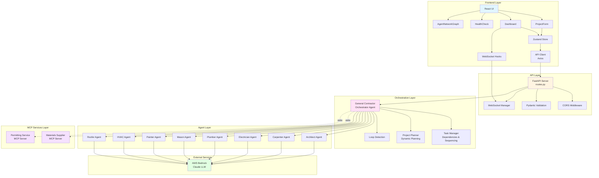
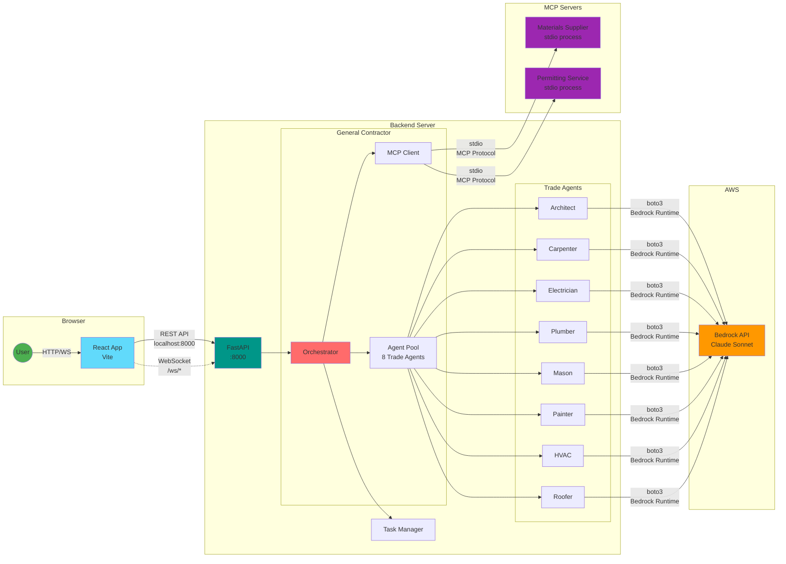
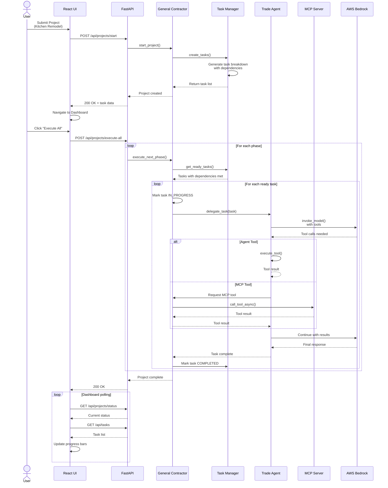
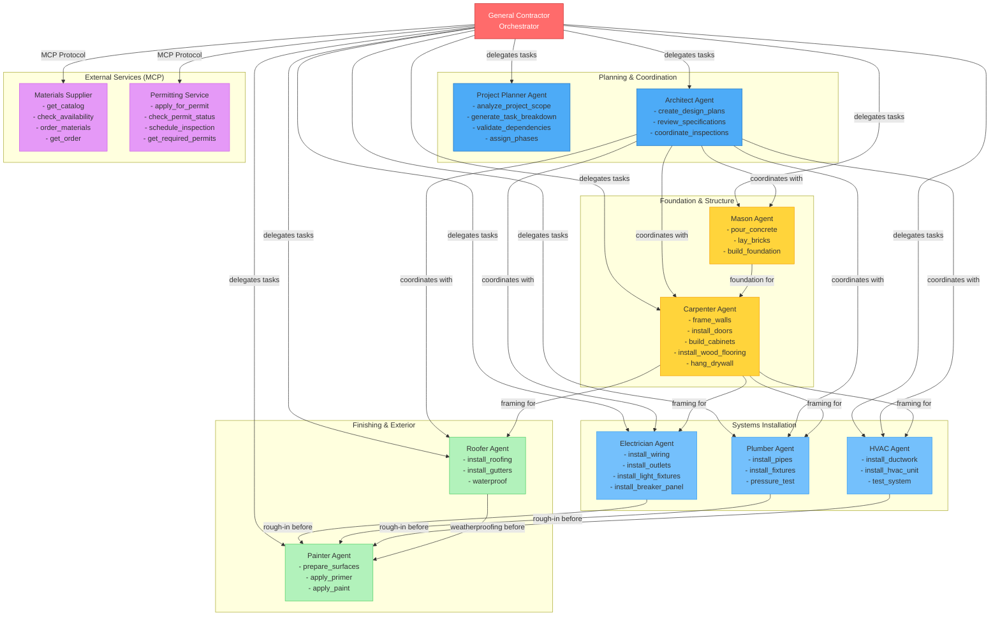
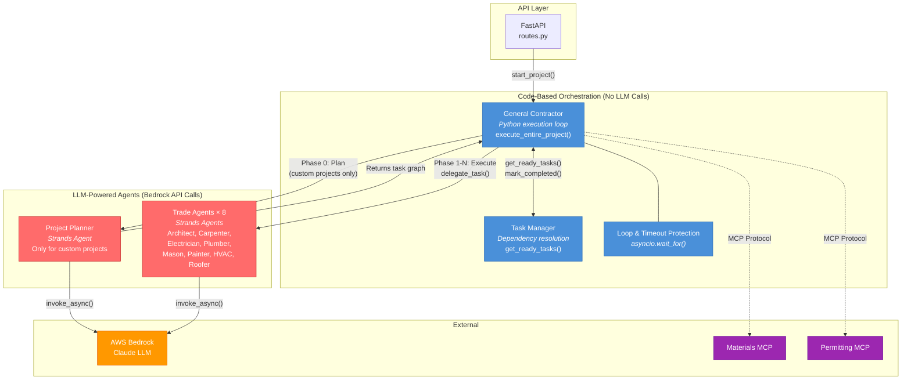
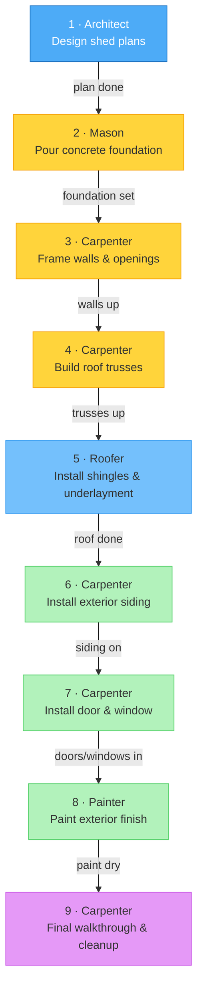
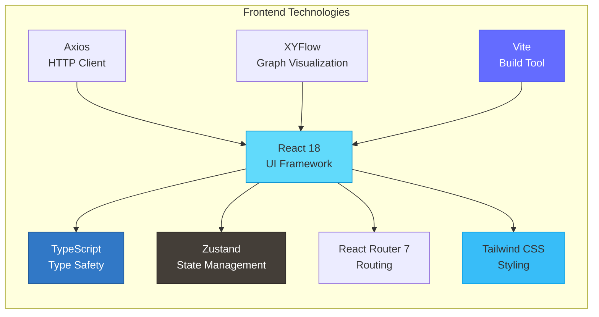
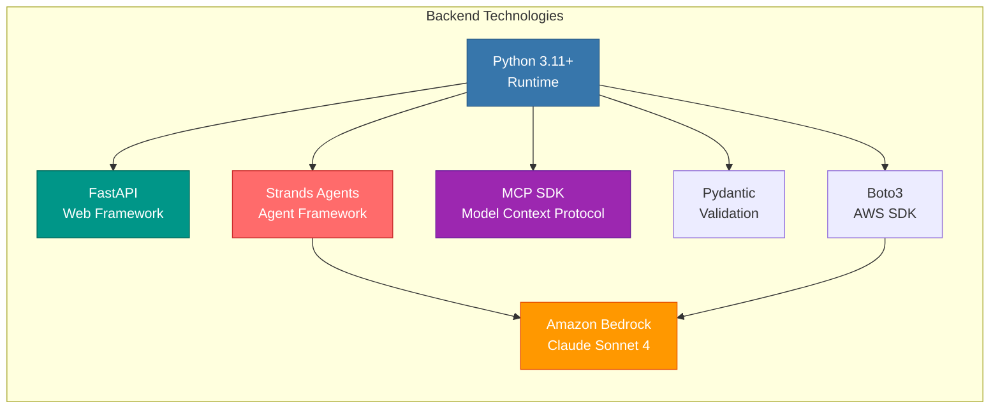
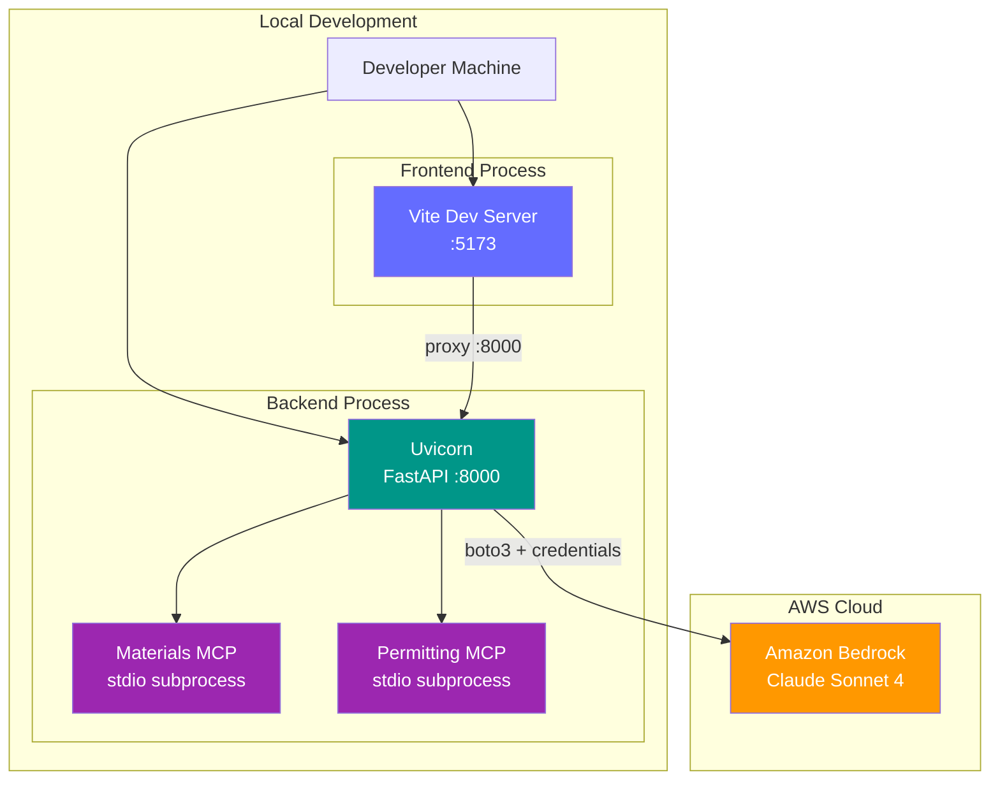
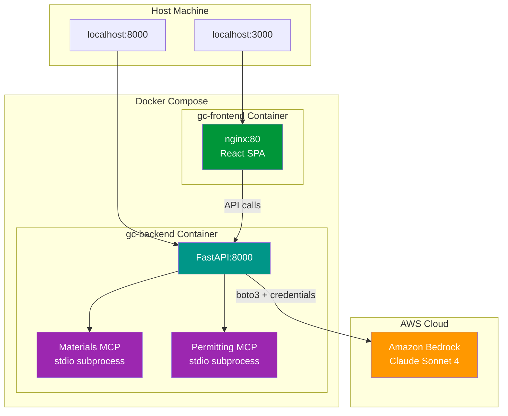

# System Architecture

This document provides a comprehensive overview of the General Contractor Agent Demo system architecture, illustrating the major components and their interactions.

## Table of Contents

1. [System Architecture Overview](#system-architecture-overview)
2. [Component Interaction Diagram](#component-interaction-diagram)
3. [Data Flow: User Request Lifecycle](#data-flow-user-request-lifecycle)
4. [Agent Network Architecture](#agent-network-architecture)
5. [Technology Stack](#technology-stack)
6. [Design Philosophy](#design-philosophy)

---

## System Architecture Overview

This diagram shows the layered architecture of the system, from the user interface down to external services.



---

## Component Interaction Diagram

This diagram illustrates the detailed connections and communication protocols between components.



---

## Data Flow: User Request Lifecycle

This sequence diagram shows the complete lifecycle of a project execution request.



---

## Agent Network Architecture

This diagram shows the relationships between agents and their specialized tools.



---

## Orchestration Model: Code vs. LLM

A key architectural distinction: the **General Contractor is NOT an LLM agent**. It is a deterministic Python execution loop that makes zero Bedrock API calls. Only the Project Planner and the 8 trade agents are LLM-powered.

This "plan-then-execute" pattern means the LLM generates the task graph, then deterministic code executes it.



**Legend:** Blue = deterministic Python code (no LLM). Red = LLM-powered Strands agents (Bedrock API calls).

### Why No LLM Orchestrator?

| Aspect             | Code Orchestrator (Current)     | LLM Orchestrator (Alternative)   |
| ------------------ | ------------------------------- | -------------------------------- |
| **Cost**           | $0 for orchestration            | Extra Bedrock calls per decision |
| **Speed**          | Instant task dispatch           | Seconds of LLM latency per step  |
| **Reliability**    | Deterministic, no hallucination | May hallucinate or loop          |
| **Token Usage**    | Zero orchestration tokens       | Significant token overhead       |
| **Predictability** | Same input = same execution     | May vary between runs            |

The General Contractor appears in no token usage reports because it makes zero LLM calls. All Bedrock API calls come from the Project Planner (for custom projects) and the 8 trade agents.

### Example Task Graph: Shed Construction

This is the actual dependency graph produced by the shed construction template. Each node is a task; arrows show "must complete before" dependencies. The General Contractor walks this graph using `get_ready_tasks()`, executing tasks whose dependencies are all satisfied.



**Phases:** Blue = planning, Yellow = foundation/framing, Light blue = rough-in, Green = finishing, Purple = final inspection.

The TaskManager resolves this graph at runtime: task 3 won't start until task 2 is marked complete, task 5 won't start until task 4 is done, and so on. For projects with parallel branches (e.g., electrical and plumbing rough-in happening simultaneously), multiple tasks can be ready at the same time.

### Execution Flow

```text
Template Project                    Custom Project
──────────────                      ──────────────
1. API receives request             1. API receives request
2. GC loads hardcoded template      2. GC invokes Project Planner (LLM)
   (no LLM call)                       → Planner returns task graph
3. TaskManager builds task graph    3. TaskManager builds task graph
4. GC execution loop:               4. GC execution loop:
   ├─ get_ready_tasks()                ├─ get_ready_tasks()
   ├─ delegate to trade agent (LLM)    ├─ delegate to trade agent (LLM)
   ├─ mark_completed()                 ├─ mark_completed()
   └─ repeat until done                └─ repeat until done
```

---

## Technology Stack

### Frontend Stack



### Backend Stack



### Architecture Patterns

| Layer                 | Pattern                      | Purpose                                       |
| --------------------- | ---------------------------- | --------------------------------------------- |
| **Frontend**          | Component-based architecture | Modular, reusable UI components               |
| **State**             | Centralized store (Zustand)  | Single source of truth for application state  |
| **API**               | RESTful + WebSocket          | Synchronous requests + real-time updates      |
| **Orchestration**     | Coordinator pattern          | Central agent delegates to specialized agents |
| **Task Management**   | Dependency resolution        | Ensures tasks execute in correct order        |
| **Agents**            | Tool-calling pattern         | LLM agents with specialized capabilities      |
| **External Services** | MCP Protocol                 | Standardized AI-to-service communication      |
| **Error Handling**    | Loop detection + timeouts    | Prevents infinite loops and runaway processes |

---

## Key Features

### Multi-Agent Coordination

- **8 specialized trade agents** each with domain-specific tools
- **Central orchestrator** (General Contractor) manages delegation
- **Task dependency resolution** ensures correct execution order
- **Phase-based sequencing** mirrors real construction workflows

### External Service Integration

- **MCP (Model Context Protocol)** for standardized service communication
- **Materials Supplier** for inventory and ordering
- **Permitting Service** for compliance and inspections
- **Stdio transport** for process isolation

### Planning Strategies

The system uses two different planning approaches depending on the project type:

#### Template-Based Planning (Default)

For common project types, the system uses predefined task templates that don't require LLM planning:

| Project Type | Planning Mode | Project Planner Used? |
|--------------|---------------|----------------------|
| Kitchen Remodel | Template | No |
| Bathroom Remodel | Template | No |
| Shed Construction | Template | No |
| New Construction | Template | No |
| Home Addition | Template | No |

Template-based planning is faster and more cost-effective since it skips the LLM planning step.

#### Dynamic LLM-Powered Planning

For custom or unusual projects, the **Project Planner Agent** is invoked to dynamically generate a task breakdown:

| Project Type | Planning Mode | Project Planner Used? |
|--------------|---------------|----------------------|
| Custom Project | Dynamic | Yes |
| Dog House | Dynamic | Yes |
| Treehouse | Dynamic | Yes |
| Home Theater | Dynamic | Yes |
| Any non-template type | Dynamic | Yes |

The Project Planner Agent uses Claude to:
1. Analyze project scope and requirements
2. Generate a detailed task breakdown
3. Validate task dependencies
4. Assign construction phases
5. Finalize the executable plan

**Note:** If you don't see the Project Planner node active in the Agent Network Graph, it's likely because you're running a template-based project. To see the Project Planner in action, start a custom project or use a project type without a predefined template.

#### Validation Layer

Both planning modes include validation to ensure all required information is provided before execution begins.

### Real-time Monitoring

- **WebSocket support** for live updates (optional)
- **Polling fallback** for simpler deployment
- **Comprehensive health checks** for all system components
- **Agent activity tracking** shows which agents are active

### Error Recovery

- **Loop detection** prevents infinite tool calling
- **Task timeouts** prevent runaway executions
- **Skip/retry functionality** for stuck or failed tasks
- **Detailed error reporting** with actionable suggestions

---

## Communication Protocols

| Protocol                | Usage                        | Components                       |
| ----------------------- | ---------------------------- | -------------------------------- |
| **HTTP REST**           | Synchronous API calls        | Frontend ↔ Backend               |
| **WebSocket**           | Real-time updates (optional) | Frontend ↔ Backend               |
| **MCP over stdio**      | External service tool calls  | General Contractor ↔ MCP Servers |
| **Bedrock Runtime API** | LLM inference                | Agents ↔ AWS Bedrock             |
| **boto3**               | AWS service communication    | Backend ↔ AWS                    |

---

## Deployment Architecture

### Local Development (Without Docker)



### Docker Deployment



**Docker containers:**

| Container      | Image            | Port       | Purpose                |
| -------------- | ---------------- | ---------- | ---------------------- |
| `gc-frontend`  | nginx:alpine     | 3000 → 80  | Serves React SPA       |
| `gc-backend`   | python:3.13-slim | 8000       | FastAPI + Agents + MCP |

See [DOCKER.md](DOCKER.md) for complete Docker deployment guide.

---

## File Structure

```text
general-contractor-agent-demo/
├── backend/
│   ├── agents/
│   │   ├── general_contractor.py    # Main orchestrator
│   │   ├── project_planner.py       # Dynamic planning agent
│   │   ├── architect.py              # Design & planning
│   │   ├── carpenter.py              # Framing & woodwork
│   │   ├── electrician.py            # Electrical systems
│   │   ├── plumber.py                # Plumbing systems
│   │   ├── mason.py                  # Foundation & masonry
│   │   ├── painter.py                # Finishing work
│   │   ├── hvac.py                   # HVAC systems
│   │   └── roofer.py                 # Roofing & weatherproofing
│   ├── mcp_servers/
│   │   ├── materials_supplier.py     # Materials MCP server
│   │   └── permitting.py             # Permitting MCP server
│   ├── orchestration/
│   │   └── task_manager.py           # Task dependency management
│   ├── api/
│   │   └── routes.py                 # FastAPI routes
│   ├── utils/
│   │   └── loop_detection.py         # Loop prevention
│   └── config.py                     # Configuration
├── frontend/
│   └── src/
│       ├── components/
│       │   ├── ProjectForm.tsx       # Project submission
│       │   ├── Dashboard.tsx         # Main dashboard (WebSocket)
│       │   ├── DashboardSimple.tsx   # Polling dashboard
│       │   ├── AgentNetworkGraph.tsx # Visual agent graph
│       │   ├── HealthCheck.tsx       # System health
│       │   └── ErrorModal.tsx        # Error display
│       ├── api/
│       │   └── client.ts             # API client
│       ├── store/
│       │   └── projectStore.ts       # Zustand state
│       ├── hooks/
│       │   └── useWebSocket.ts       # WebSocket hook
│       └── App.tsx                   # Root component
└── docs/
    └── architecture.md               # This file
```

---

## Design Philosophy

### Plan-Then-Execute with Code-Based Orchestration

This project follows a **plan-then-execute** architecture: an LLM generates the task graph (the "what"), then deterministic Python code orchestrates execution (the "how"). This is a deliberate separation of concerns - intelligence is used where it adds value (planning, domain reasoning) and avoided where it adds cost without benefit (sequencing, dependency resolution).

The pattern has deep roots:

- **Classical AI planning** (1970s+) established the principle of separating plan generation from plan execution. Systems like STRIPS and HTN (Hierarchical Task Networks) generated action sequences that were then executed by deterministic interpreters.
- **Workflow engines** like Apache Airflow, Prefect, and Dagster popularized DAG-based task orchestration in software engineering - define a dependency graph, then a scheduler walks it.
- **Modern LLM agent frameworks** have adopted similar patterns. LangGraph's "Plan-and-Execute" agent, ReWOO (Reasoning WithOut Observation), and Strands Agents' own workflow pattern all separate planning from execution to reduce LLM calls and improve reliability.

### Why This Approach

The alternative - using an LLM as the orchestrator (as CrewAI and AutoGen do) - would mean every scheduling decision requires a Bedrock API call. For a 10-task project, that's 10+ extra LLM round-trips just to decide "what runs next," a question the dependency graph already answers deterministically.

The code-based orchestrator provides:

- **Zero orchestration cost** - No Bedrock calls for task dispatch
- **Deterministic behavior** - Same project = same execution order, every time
- **No orchestration hallucination** - The scheduler can't "forget" a dependency or invent tasks
- **Sub-millisecond dispatch** - No LLM latency between tasks

Intelligence is concentrated where it matters:

- **Project Planner agent** - Uses LLM to generate task breakdowns for novel project types (dynamic DAG creation)
- **Trade agents** - Use LLM to reason about domain-specific work, call tools, and produce detailed results
- **MCP servers** - Provide structured access to external services (materials, permits)

### Domain Fit

Construction maps naturally to DAG-based execution because real-world construction has strict physical dependency ordering: you cannot install roofing before framing, you cannot paint before drywall. These constraints are inherent to the domain, not arbitrary - making a dependency graph the right abstraction.

The construction metaphor also maps well to multi-agent specialization. Real construction crews have distinct trades (electrician, plumber, carpenter) that work independently within their domain but coordinate through a general contractor. This project mirrors that structure directly.

### Hybrid Planning

The system uses a pragmatic hybrid:

- **Template-based planning** for known project types (kitchen remodel, shed, etc.) - instant, free, predictable
- **LLM-based dynamic planning** for arbitrary project types - flexible, uses Claude's construction knowledge to generate novel task graphs

This avoids the false choice between "hard-coded only" and "LLM for everything." Templates handle the common case efficiently; the LLM handles the long tail of custom projects.

---

## Next Steps

For more detailed information, see:

- [README.md](../README.md) - Project overview and setup
- [Backend Source](../backend/) - Python backend implementation
- [Frontend Source](../frontend/src/) - React frontend implementation
- Individual agent files for tool specifications
